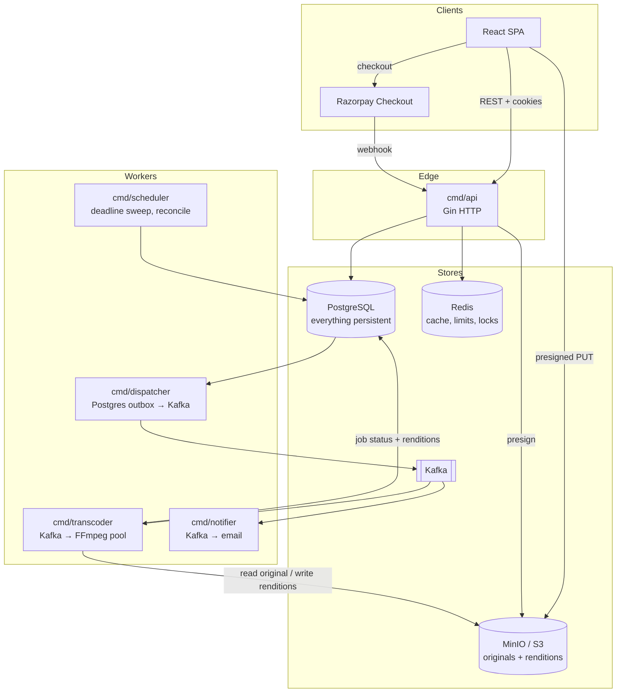

# CineFund

**Crowdfunding and streaming for short films.** Creators launch campaigns for films
that don't exist yet, backers fund them, and the films that get funded are
transcoded, packaged and streamed on the same platform.

The design came first, deliberately: every line is written against these
documents, so the documents have to be precise enough to code from without
re-deciding anything mid-file.

**Current state:** Group A0/A1 scaffolding is in — module skeleton, local
infrastructure, config/logging/errors, the migration runner and the money-path
schema (pledges, payment events, refunds, the double-entry ledger with its
deferred balance trigger, and the outbox). `go build ./...` is green. The
domain services are next; see [16 — Build order](docs/16-BUILD-ORDER.md).

---

## Why this project exists

The interesting part is not the CRUD. It's the four places where a naive
implementation is quietly wrong:

1. **A payment webhook arrives twice.** Razorpay retries on timeout. A naive
   `campaign.raised += amount` double-credits the campaign. Fixed with a Redis
   `SETNX` guard in front of a Postgres unique constraint — belt and braces,
   because Redis can lose the key.
2. **The database commits and the process dies before publishing.** The pledge
   is recorded but no receipt email is ever sent and the search index goes
   stale. Fixed with a transactional outbox: the domain write and the event
   insert are one Postgres transaction, and a separate dispatcher moves rows to
   Kafka.
3. **Transcoding a 4 GB film inside an HTTP handler.** Fixed by never letting
   bytes touch the API: presigned upload straight to object storage, a Mongo
   change stream turning the status flip into a job, and a pool of Go workers
   shelling out to FFmpeg.
4. **All-or-nothing funding.** Money is held, not spent. If the campaign misses
   its goal at the deadline, every pledge refunds. That requires a real ledger,
   not an integer column.

Everything else in this spec exists to serve those four.

---

## Stack

| Concern | Choice | Why |
| --- | --- | --- |
| HTTP API | Go 1.26 + [Gin](https://github.com/gin-gonic/gin) | Same framework as the MagicStream server, so the middleware ports over |
| Everything persistent | **PostgreSQL 16** (`pgx/v5`, no ORM) | Real ACID, `CHECK`/`UNIQUE` constraints that make double-crediting impossible at the storage layer, `FOR UPDATE SKIP LOCKED` for the outbox dispatcher, and `JSONB` for the genuinely document-shaped parts (ffprobe output, rendition lists) |
| Cache, locks, limits | **Redis 7** | Response cache, token-bucket rate limiting (Lua), idempotency fast path, distributed locks |
| Event bus | **Kafka** (`franz-go`) | Durable, replayable, partitioned-by-aggregate domain events |
| Object storage | **MinIO** locally, S3-compatible in prod (`minio-go/v7`) | Presigned PUT for uploads, presigned GET for playback |
| Transcoding | **FFmpeg / ffprobe** subprocess | HLS ABR ladder, thumbnails, sprite sheets |
| Payments | **Razorpay** (Orders + Webhooks) | Card data never touches this codebase |
| Telemetry | `log/slog`, OpenTelemetry, Prometheus | Trace IDs propagate across HTTP → Kafka → worker |

### Why one datastore, not two

An earlier revision split this across Postgres and MongoDB — Postgres for money,
Mongo for the catalog and media pipeline. That was reversed before any code was
written. The full reasoning is in
[ADR-0010](docs/DECISIONS/ADR-0010-postgres-only.md); the short version:

> **The outbox already solves reliable publishing.** Mongo was brought in partly
> for change streams, on the grounds that Postgres has no CDC without Debezium —
> which is exactly *why the outbox exists*. Once you have the outbox, the change
> stream is a second mechanism doing the first one's job.

The catalog's genuinely document-shaped data — ffprobe output, rendition lists —
lives in `JSONB` columns. Nothing here is queried in a way that needed Mongo's
operators, and a single store means every financial invariant stays declarative
and every read is transactionally consistent with the write that produced it.

So there is **one event mechanism**:

| Source of truth | Mechanism | Used for |
| --- | --- | --- |
| Postgres | Transactional outbox table + dispatcher | Every domain event — money, campaign lifecycle, and media pipeline transitions alike |

[ADR-0001](docs/DECISIONS/ADR-0001-polyglot-persistence.md) and
[ADR-0004](docs/DECISIONS/ADR-0004-outbox-vs-change-streams.md) are kept in the
tree as superseded records: how the thinking moved is worth more than a tidy
history.

---

## System at a glance

---

## Read the documents in this order

Each one assumes you've read the ones above it.

| # | Document | What you get from it |
| --- | --- | --- |
| 00 | [Product spec](docs/00-PRODUCT-SPEC.md) | Actors, the funding rules, state machines, glossary |
| 01 | [Architecture](docs/01-ARCHITECTURE.md) | Components, boundaries, request lifecycle, failure modes |
| 02 | [Postgres data model](docs/02-DATA-MODEL-POSTGRES.md) | Every table, column, index, constraint and invariant |
| 03 | [Mongo data model](docs/03-DATA-MODEL-MONGO.md) | Every collection, document shape and index |
| 04 | [API spec](docs/04-API-SPEC.md) | Every endpoint: request, response, errors, status codes |
| 05 | [Auth & security](docs/05-AUTH-SECURITY.md) | JWT rotation with reuse detection, RBAC, threat model |
| 06 | [Payments (Razorpay)](docs/06-PAYMENTS-RAZORPAY.md) | Order creation, webhook verification, idempotency, refunds |
| 07 | [Ledger](docs/07-LEDGER.md) | Double-entry accounts, every money movement, reconciliation |
| 08 | [Eventing](docs/08-EVENTING-OUTBOX-KAFKA.md) | Outbox, change streams, topics, envelope, retries, DLQ |
| 09 | [Media pipeline](docs/09-MEDIA-PIPELINE.md) | Upload → probe → transcode → HLS, the FFmpeg specifics |
| 10 | [Object storage](docs/10-OBJECT-STORAGE.md) | Bucket layout, key scheme, presigning, lifecycle rules |
| 11 | [Caching](docs/11-CACHING-REDIS.md) | Key scheme, TTLs, invalidation, stampede protection |
| 12 | [Rate limiting](docs/12-RATE-LIMITING.md) | Layered buckets, the Lua script, headers, tuning |
| 13 | [gRPC control plane](docs/13-GRPC-CONTROL-PLANE.md) | Protobuf contracts, streaming progress, cancellation |
| 14 | [Observability](docs/14-OBSERVABILITY.md) | Logs, metrics, traces, SLOs, the alerts that matter |
| 15 | [Project layout](docs/15-PROJECT-LAYOUT.md) | The exact file tree, and what every package owns |
| 16 | [Build order](docs/16-BUILD-ORDER.md) | 12 phases, each with acceptance criteria |
| 17 | [Testing strategy](docs/17-TESTING-STRATEGY.md) | What to unit test, what needs testcontainers |
| 18 | [Local dev & deploy](docs/18-LOCAL-DEV-DEPLOY.md) | docker-compose, env vars, migrations, runbook |
| 19 | [Performance](docs/19-PERFORMANCE.md) | load tests, the bottlenecks, profiling, capacity model, 100× |
| — | [Decision records](docs/DECISIONS/README.md) | Why each contested choice went the way it did |
| — | [Devlog](docs/DEVLOG.md) | Running notes: what broke, what was tried, what was chosen |

---

## Ground rules for the implementation

These are the conventions the whole codebase assumes. Deciding them once here
means never deciding them again in a file.

1. **Money is `BIGINT` paise. Never float, never decimal-in-Go.** A ₹500 pledge
   is `50000`. Formatting to rupees happens in the presentation layer only.
2. **Every mutating endpoint that a client can retry takes an
   `Idempotency-Key` header.** See [06](docs/06-PAYMENTS-RAZORPAY.md#idempotency-keys-on-client-requests).
3. **Handlers do no business logic.** `handler` parses and validates, `service`
   decides, `repo` persists. A handler that touches `pgx` directly is a bug.
4. **Every external call takes a `context.Context` with a deadline.** No
   `context.Background()` below `main` and the consumer loops.
5. **Errors are typed** (`platform/errs`) and mapped to HTTP status in exactly
   one place — the error middleware. Handlers never call `c.JSON(500, ...)`.
6. **Every Kafka consumer is idempotent**, because delivery is at-least-once.
   Assume every message arrives twice and out of order.
7. **No secret is ever logged**, and no full payment payload is logged. Log
   `event_id`, `payment_id`, amount, and status — nothing else.
8. **Migrations are forward-only and numbered.** No editing a committed
   migration, ever.
9. **The API never streams video bytes.** It signs URLs. The one exception is
   the HLS playlist rewriter, which serves text.

---

## Build plan

Built as a **vertical slice first** — the video path end to end before any auth
or money — so the largest unknown is de-risked in week 2 rather than week 9, and
every stopping point is a working system rather than N half-built layers.

| Group | Scope | Hours | Milestone |
| --- | --- | --- | --- |
| **A** — video spine | upload → transcode → HLS → plays in a browser | 45 | video plays |
| **B** — money spine | auth, rate limiting, campaigns, payments + idempotency, ledger, outbox → Kafka, change streams | 67 | money works |
| **C** — completion | entitlements, gRPC, concurrency tests, load test with before/after numbers, fault-injection recording | 41 | **complete and demonstrable** |
| **D** — depth | read model, caching, DLQ, reconciliation, observability, ops CLI, pprof | 71 | production-shaped |

**Group C is the checkpoint that matters.** After it, every capability claimed
here is demonstrable. Group D is built afterwards and does not gate anything.

Full phase-by-phase plan, acceptance criteria, calendar and risk register in
[docs/16 — Build order](docs/16-BUILD-ORDER.md).

### Size

Group A+B+C is ~6,400 lines of Go you write (~9,600 in the repo including tests
and generated protobuf). Of those, roughly **2,500 involve a real decision** —
the rest is six domains sharing one five-file shape. A ~480-line core carries
almost all of the design risk; [16 §3](docs/16-BUILD-ORDER.md#3-what-to-hand-write)
names the files.

### Schedule risk

The FFmpeg pipeline (A3–A4) is the largest single risk. It is scheduled **first**
for that reason. Budget 26 hours and expect the ABR ladder, keyframe alignment
and pixel-format handling to consume most of it.

---

## License

Apache-2.0.
