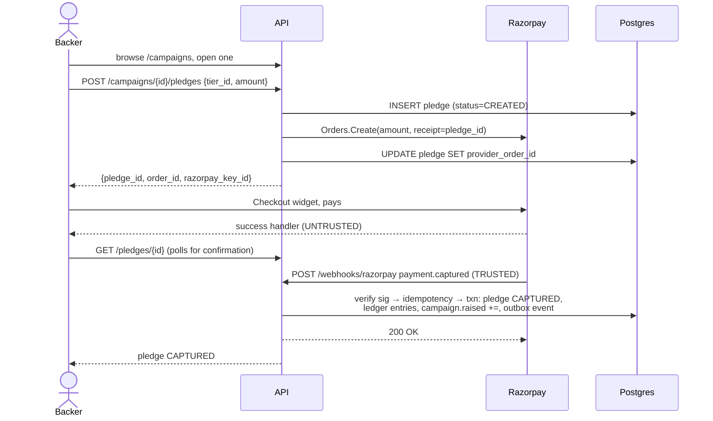
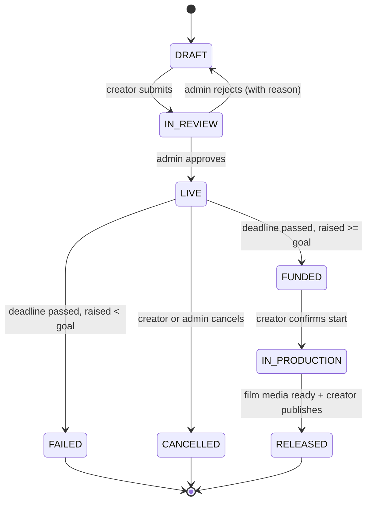
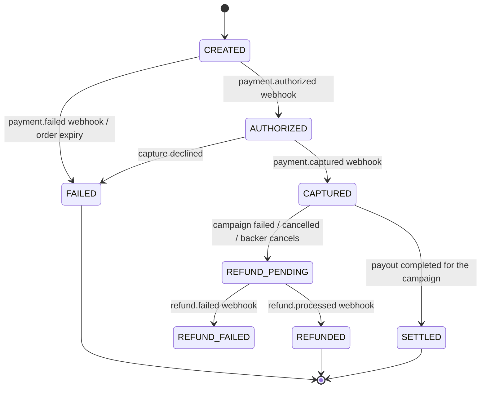
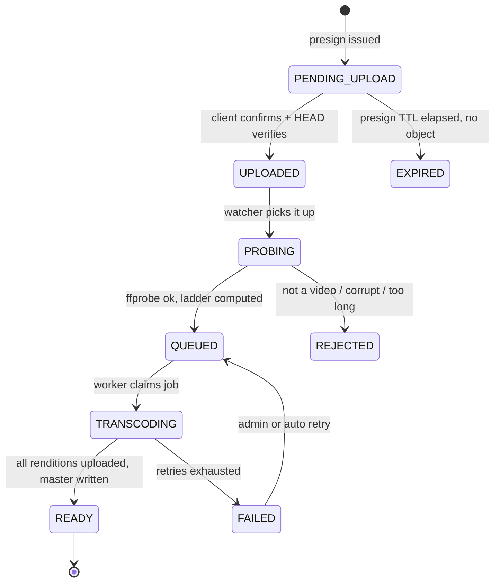

# 00 — Product Spec

What the system does, for whom, and under what rules. No technology here on
purpose — if a rule in this document is unclear, every downstream design
decision inherits the ambiguity.

---

## 1. Glossary

Use these words exactly, everywhere: in code, in table names, in event types, in
commit messages. Half of a domain model's value is that everyone means the same
thing by "pledge".

| Term | Meaning |
| --- | --- |
| **Campaign** | A creator's funding drive for one short film. Has a goal, a deadline, and reward tiers. |
| **Creator** | The user who owns a campaign. A user becomes a creator by having a verified creator profile. |
| **Backer** | A user who has pledged to a campaign. Not a role — a relationship. |
| **Pledge** | A backer's commitment of money to a campaign, at a chosen reward tier. One pledge = one payment attempt chain. |
| **Reward tier** | A named funding level (₹500 "Digital Access", ₹5000 "Executive Producer credit") with a description, optional quantity limit, and the entitlements it grants. |
| **Goal** | The paise amount a campaign must raise by its deadline to be funded. |
| **Raised** | Sum of `captured` pledges. Never includes pending or failed ones. |
| **Deadline** | The instant funding closes. Stored UTC, always exclusive (`< deadline`). |
| **All-or-nothing** | If `raised < goal` at the deadline, every pledge is refunded and the creator receives nothing. |
| **Escrow** | The ledger account holding captured funds for a campaign before it succeeds. Not a real bank account — an accounting position. |
| **Entitlement** | A grant that lets a specific user do something with a specific film (watch early, download, see their name in credits). |
| **Film** | The finished work. Created when a campaign is funded; released when its media is transcoded and the creator publishes. |
| **Media asset** | One uploaded file (pitch video, final film, trailer) and everything derived from it. |
| **Rendition** | One output of transcoding a media asset — e.g. the 720p HLS variant. |
| **Payout** | Money moving from campaign escrow to the creator, minus platform fee. |

---

## 2. Actors

| Actor | Can | Cannot |
| --- | --- | --- |
| **Anonymous visitor** | Browse live campaigns, view campaign pages, watch public trailers and released public films | Pledge, upload, comment |
| **Backer** (any registered user) | Everything above, plus pledge, comment, follow campaigns, watch films they hold entitlements for, manage their profile | Create campaigns |
| **Creator** (user with an approved creator profile) | Everything a backer can, plus create/edit/submit campaigns they own, upload media for their own campaigns, post campaign updates, request payout | Touch another creator's campaign |
| **Admin** | Review and approve/reject campaigns and creator profiles, force-fail a campaign, issue manual refunds, view the ledger, replay DLQ messages | Nothing is off-limits, but every admin action is audit-logged |
| **System** (workers, scheduler) | Transition campaigns at deadline, capture/refund payments, transcode media, project read models, send notifications | — |

A single user row carries `role ∈ {USER, ADMIN}`. "Creator" is *not* a role —
it's derived from having an approved row in `creator_profiles`. This matters:
roles gate endpoints, creator status gates *ownership* of a resource, and
conflating them is how you end up with an IDOR.

---

## 3. Core user journeys

### 3.1 Backer funds a film

**The rule that matters:** the browser's success callback is a UI hint, never a
state transition. Only the signed webhook moves money. A backer who closes the
tab mid-payment still gets credited.

### 3.2 Creator runs a campaign

1. Registers, submits a creator profile → admin approves.
2. Creates a campaign in `DRAFT`. Edits freely: title, synopsis, goal, deadline,
   reward tiers, pitch video.
3. Uploads a pitch video → presigned PUT → transcode → HLS available.
4. Submits for review → `IN_REVIEW`. **Now immutable** except for a small
   allow-list of fields (see §5.2).
5. Admin approves → `LIVE`. The deadline clock starts from the publish time if
   the campaign was configured with a duration rather than a fixed date.
6. Posts updates to backers during the run.
7. At deadline: system computes `raised >= goal` → `FUNDED` or `FAILED`.
8. If funded: creator uploads the finished film, it transcodes, creator
   publishes → `RELEASED`. Entitlements activate.
9. Creator requests payout of escrow minus platform fee.

### 3.3 Backer watches a film

1. `GET /films/{id}` returns metadata plus a `playback` block describing whether
   this viewer may watch and why.
2. If entitled, `GET /films/{id}/playback` returns a short-lived signed master
   playlist URL.
3. Player fetches the master playlist, picks a variant, streams segments.

---

## 4. Funding rules

These are the rules that make or lose money. Each one becomes a test.

| # | Rule |
| --- | --- |
| F1 | Funding is **all-or-nothing**. At the deadline, if `raised < goal`, every `CAPTURED` pledge is refunded in full and the campaign is `FAILED`. |
| F2 | `raised` counts **only** pledges in state `CAPTURED`. Never `CREATED`, `AUTHORIZED`, `FAILED` or `REFUNDED`. |
| F3 | A pledge's amount must be **≥ its reward tier's minimum**. Backers may over-pledge; they may not under-pledge. |
| F4 | A reward tier with `quantity_limit` set may not be claimed more times than the limit by `CAPTURED` pledges. Enforced with a row lock on the tier inside the capture transaction, not with a read-then-write. |
| F5 | Pledges are **not accepted after the deadline**, evaluated server-side at pledge-creation time with a small safety margin (no new orders in the last 60 seconds). |
| F6 | A campaign may be **over-funded**. There is no cap; `raised` can exceed `goal`. |
| F7 | The **platform fee** is 7% of `raised`, computed once at payout time, rounded down to paise, and recorded as a ledger entry. Gateway fees are separate and recorded from the webhook payload. |
| F8 | A backer may pledge **multiple times** to the same campaign. Each pledge is independent. |
| F9 | A backer may **cancel** a pledge while the campaign is `LIVE` and more than 24 hours remain before the deadline. Cancellation triggers a full refund. |
| F10 | Refunds are **initiated** by the system but **settled** asynchronously by Razorpay. A pledge sits in `REFUND_PENDING` until the `refund.processed` webhook arrives. |
| F11 | A creator **cannot pledge to their own campaign**. |
| F12 | Currency is **INR only** in v1. The `currency` column exists but is `CHECK (currency = 'INR')`. Remove the check when multi-currency is real, not before. |

---

## 5. State machines

Write these as explicit transition tables in Go, not as scattered `if`
statements. A single `CanTransition(from, to State) bool` used by every caller
is how you avoid a campaign going `FAILED → LIVE` because one code path forgot.

### 5.1 Campaign

| From | To | Trigger | Side effects |
| --- | --- | --- | --- |
| `DRAFT` | `IN_REVIEW` | creator submits | validation gate: goal, deadline, ≥1 tier, pitch video transcoded |
| `IN_REVIEW` | `LIVE` | admin approves | set `published_at`, resolve deadline, emit `campaign.published` |
| `IN_REVIEW` | `DRAFT` | admin rejects | store `review_note` |
| `LIVE` | `FUNDED` | scheduler at deadline | emit `campaign.funded`, create `films` row, keep escrow |
| `LIVE` | `FAILED` | scheduler at deadline | emit `campaign.failed`, enqueue refund for every captured pledge |
| `LIVE` | `CANCELLED` | creator (only if `raised == 0`) or admin (any time) | refund all captured pledges |
| `FUNDED` | `IN_PRODUCTION` | creator | — |
| `IN_PRODUCTION` | `RELEASED` | creator publishes, film media `READY` | activate entitlements, emit `film.released` |

**Terminal states:** `FAILED`, `CANCELLED`, `RELEASED`. No transition leaves them.

### 5.2 Fields editable per campaign state

| Field | DRAFT | IN_REVIEW | LIVE | FUNDED+ |
| --- | --- | --- | --- | --- |
| title, synopsis, category | ✅ | ❌ | ❌ | ❌ |
| goal_amount, deadline | ✅ | ❌ | ❌ | ❌ |
| reward tiers (add/edit/remove) | ✅ | ❌ | ❌ | ❌ |
| pitch video | ✅ | ❌ | ❌ | ❌ |
| cover image | ✅ | ✅ | ✅ | ✅ |
| long description / risks | ✅ | ✅ | ✅ | ✅ |
| campaign updates (append-only) | ❌ | ❌ | ✅ | ✅ |

Freezing goal and deadline at `IN_REVIEW` is a trust rule, not a technical one:
backers pledged against a specific promise.

### 5.3 Pledge

Razorpay in auto-capture mode collapses `AUTHORIZED → CAPTURED` into a single
`payment.captured` event. Model both states anyway — manual capture becomes
necessary the moment you want to hold funds until the deadline, and retro-fitting
a state into a live payment system is miserable.

### 5.4 Media asset

---

## 6. Entitlements

What a backer actually gets. This is the bridge between "paid money" and "can
press play", and it is the thing most crowdfunding clones get wrong by checking
`pledge.status == CAPTURED` at playback time. Don't — grant an explicit
entitlement row at release time and check that.

| Entitlement | Granted by | Effect |
| --- | --- | --- |
| `EARLY_ACCESS` | any captured pledge on a funded campaign | watch the film during the backer-only window (default 30 days from release) |
| `DOWNLOAD` | tier flag | a presigned GET on the highest rendition, TTL 1 hour, rate limited |
| `CREDIT` | tier flag | name appears in the film's credits list |
| `BTS` | tier flag | access to behind-the-scenes media assets |

Playback authorisation resolves in this order, first match wins:

1. Film is `PUBLIC` and past its early-access window → allow.
2. Viewer is the film's creator → allow.
3. Viewer is an admin → allow, and audit-log it.
4. Viewer holds an active `EARLY_ACCESS` entitlement → allow.
5. Otherwise → `403` with a machine-readable `reason` so the UI can say *why*.

---

## 7. Non-goals for v1

Writing these down is what stops scope creep at 2 a.m. Everything here is a
**decision**, not an omission — which is the difference between a scoped project
and an unfinished one. Say so in the README.

### Product

- No multi-currency, no international payouts.
- No live streaming, no DRM (Widevine/FairPlay). Signed short-TTL URLs only, and
  they deter casual sharing rather than preventing determined downloading. See
  [ADR-0008](DECISIONS/ADR-0008-hls-access-control.md).
- No social graph beyond "follow a campaign".
- No mobile apps.
- No recommendation ML.
- No creator-to-creator collaboration or revenue splits.
- No KYC flow — creator approval is a manual admin decision. **This makes
  CineFund a demo, not a deployable financial product.**
- **No React SPA.** Three plain pages plus an `hls.js` player, enough to
  demonstrate the API. The deliverable is a backend.

### Deliberately cut from the build

Each of these was scoped, costed, and dropped because the engineering signal
didn't justify the hours. Listed so their absence reads as intent.

| Cut | Instead |
| --- | --- |
| Comments and campaign updates | none — pure CRUD, proves nothing the rest doesn't |
| Trending leaderboard, analytics rollups | `ORDER BY raised_amount DESC` |
| Payout HTTP flow and admin approval UI | payout ledger accounts exist; settlement is a CLI operation |
| Multipart upload | single presigned PUT, **2 GB cap** |
| 1080p and 240p rungs | three rungs: 720p / 480p / 360p |
| Sprite sheets, scrub previews, WebVTT captions | poster frame only |
| `DOWNLOAD`, `CREDIT`, `BTS` entitlements | `EARLY_ACCESS` only — the others are enum values with no distinct logic |
| Creator profile approval workflow | creators publish directly |
| Hand-written OpenAPI spec | route table in [04](04-API-SPEC.md) |
| Multi-replica gRPC cancel fan-out | single API replica; growth path noted in [13 §5](13-GRPC-CONTROL-PLANE.md#5-server-side) |

### Known limitations to state honestly

- The catalog is an **eventually consistent read model** with lag bounded at 30 s.
  Funding numbers on the campaign detail page bypass it and read Postgres
  directly, because a backer must see their own pledge immediately.
- Event delivery is **at-least-once, never exactly-once**. Consumers are
  idempotent by design rather than by wishful thinking.
- The Redis distributed lock is **not Redlock** and is not safe across a Redis
  failover. It is an optimisation; correctness comes from Postgres row locks.
  See [11 §6](11-CACHING-REDIS.md#6-distributed-locks).
- The rate limiter **fails open**. [ADR-0006](DECISIONS/ADR-0006-rate-limiter-fail-open.md).

---

## 8. Success criteria for the build

The project is "done" for portfolio purposes when all of these are true and
demonstrable in a screen recording:

1. A campaign can be created, reviewed, published, funded by two different
   backers, and reach `FUNDED` at its deadline — with the ledger balancing to
   zero at every step.
2. Replaying the same Razorpay webhook 50 times changes `raised` exactly once.
3. Killing the API process between the Postgres commit and the Kafka publish
   loses **no** events — the dispatcher delivers them on restart.
4. A 500 MB source file uploads without the API process's memory rising, and
   comes back as a 4-variant HLS ladder that seeks smoothly in a browser.
5. Killing a transcoder mid-job leaves the job reclaimable, and a second worker
   finishes it without producing duplicate renditions.
6. A campaign that misses its goal refunds every backer automatically.
7. `/metrics` exposes outbox lag, consumer lag, and transcode duration, and a
   single request's `trace_id` is visible from the HTTP log through Kafka into
   the worker log.
