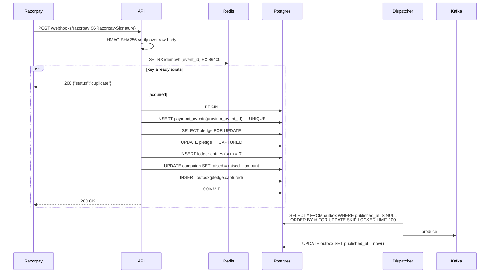
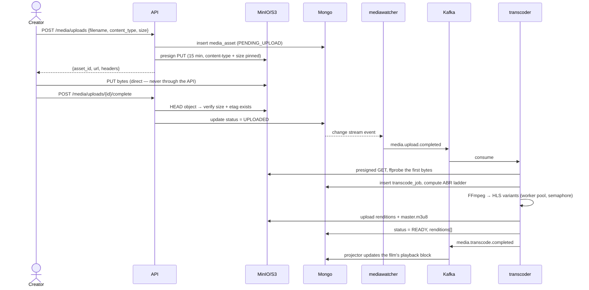

# 01 — Architecture

How the pieces fit, where the boundaries are, and what happens when each one
breaks.

> **Status note (2026-08-06).** This document was written for a two-store design
> (Postgres for money, Mongo for the catalog). MongoDB was dropped before any
> code was written — [ADR-0010](DECISIONS/ADR-0010-postgres-only.md). Treat every
> "Mongo" below as "a Postgres `JSONB` projection"; the component shapes, the
> layering, the failure-mode table and the outbox spine all still hold. The
> change-stream / mediawatcher material is obsolete and kept only as history.

---

## 1. Shape: modular monolith + purpose-built workers

CineFund is **one Go module** producing **seven binaries**. It is not
microservices, and the distinction matters: all binaries share the same
`internal/` packages, the same domain types, and the same repository code. They
differ only in what they run.

This gives you the operational separation that actually helps — a runaway FFmpeg
process cannot take down the API, and you can scale transcoders independently —
without the distributed-systems tax of versioned inter-service HTTP contracts,
service discovery, and cross-service transactions.

| Binary | Runs | Scales on | Stateless? |
| --- | --- | --- | --- |
| `cmd/api` | Gin HTTP server + gRPC server | request rate | yes |
| `cmd/dispatcher` | Postgres outbox → Kafka | outbox lag | yes (leader-agnostic, uses row locks) |
| `cmd/mediawatcher` | Mongo change stream → Kafka | n/a (single logical consumer) | no — holds a resume token |
| `cmd/transcoder` | Kafka consumer + FFmpeg worker pool | queue depth | yes |
| `cmd/notifier` | Kafka consumer → email/webhook | queue depth | yes |
| `cmd/scheduler` | cron: deadline sweep, reconciliation, cache warm | n/a (leader-elected) | no — needs a lock |
| `cmd/migrate` | one-shot schema migration | n/a | yes |

**Why `mediawatcher` is separate from `transcoder`:** a change stream must have
exactly one logical reader per resume token, but you want *many* transcoders.
Splitting them lets the watcher be a tiny singleton and the transcoders be a
horizontally-scaled pool. See [ADR-0004](DECISIONS/ADR-0004-outbox-vs-change-streams.md).

**Why `scheduler` is separate from `api`:** running cron inside every API replica
means N replicas all sweep the deadline at once. It needs either a single
instance or a Redis lease. Separate binary, `SCHEDULER_REPLICAS=1`, plus the
lease as a safety net.

---

## 2. Layering inside a domain package

Every domain package (`campaign`, `pledge`, `media`, `catalog`, `identity`)
has the same four-file shape. Learn it once, apply it five times.

```
internal/campaign/
├── model.go      domain types, state machine, invariants. No imports of pgx/gin/mongo.
├── repo.go       persistence. Takes and returns model types. Knows SQL. Knows nothing about HTTP.
├── service.go    business logic + orchestration + transaction boundaries. Depends on repo interfaces.
└── handler.go    HTTP: bind, validate, call service, shape response. No branching on business rules.
```

The dependency arrows only ever point one way:

```
handler → service → repo → driver
             ↓
           model  ← everyone
```

Three rules keep this honest:

1. **`model.go` imports nothing from `platform/postgres`, `gin`, or the Mongo
   driver.** If you can't unit-test the state machine with zero infrastructure,
   the layering has already leaked.
2. **`service.go` depends on a repository *interface* declared in the service's
   own package**, not on the concrete struct. That's what makes handler tests
   possible with a fake, and it's the exact gap the MagicStream roadmap called
   out as its biggest weakness. Fix it here from day one.
3. **The transaction boundary lives in `service.go`**, expressed as
   `s.tx.Do(ctx, func(q Queries) error { ... })`. A repo method never opens its
   own transaction, because then two repos can't share one.

---

## 3. Request lifecycle (HTTP)

```
                     ┌─────────────────────────────────────────────┐
 client ──request──► │ Recovery                                    │
                     │ RequestID      → X-Request-ID, ctx          │
                     │ Telemetry      → otel span, trace_id in ctx │
                     │ Logger         → one JSON line on completion│
                     │ CORS                                        │
                     │ RateLimit      → Redis token bucket         │
                     │ Auth           → JWT from cookie/header     │──► handler
                     │ RequireRole    → RBAC                       │
                     │ Idempotency    → replay guard (POST only)   │
                     │ ErrorMapper    → typed err → status + body  │
                     └─────────────────────────────────────────────┘
```

Order is not arbitrary:

- **RequestID before Telemetry** so the span carries the request ID as an attribute.
- **Telemetry before Logger** so the log line carries `trace_id`.
- **RateLimit before Auth** — otherwise an attacker forces an expensive JWT
  verification (and, worse, a DB lookup) on every rejected request. Rate limiting
  must be the cheapest possible gate.
- **Auth before Idempotency** because the idempotency key is scoped per user.
  A shared key namespace across users is a data-leak primitive.
- **ErrorMapper outermost of the handler-facing ones** so anything below can just
  `return err` and get correct HTTP semantics.

### Error mapping, in one place

```go
// internal/platform/errs
type Kind int
const (
    KindInternal Kind = iota  // 500
    KindInvalid               // 400
    KindUnauthenticated       // 401
    KindForbidden             // 403
    KindNotFound              // 404
    KindConflict              // 409  — state machine violations, duplicate resource
    KindExhausted             // 429
    KindUnavailable           // 503  — downstream (Razorpay, S3) is down
)
```

Handlers `return errs.Conflict("campaign is not editable in state %s", st)`.
Nothing else in the codebase writes an HTTP status code.

---

## 4. Data ownership map

The single most important diagram in this document. If you're ever unsure which
store a piece of state belongs in, it's answered here.

| Data | Store | Why | Written by |
| --- | --- | --- | --- |
| users, sessions, refresh token families | Postgres | auth correctness needs constraints | api |
| creator profiles | Postgres | approval is an audited state change | api |
| campaigns, reward tiers | Postgres | money-adjacent, needs row locks | api, scheduler |
| pledges, payments, payment_events | Postgres | must be transactional | api (webhook), scheduler |
| ledger_accounts, ledger_entries | Postgres | double-entry needs ACID | api, scheduler |
| refunds, payouts | Postgres | money | api, scheduler |
| entitlements | Postgres | authorisation decisions must not be stale | scheduler (on release) |
| outbox | Postgres | must commit with the domain write | api, scheduler |
| idempotency_keys | Postgres | durable dedupe of last resort | api |
| **film catalog** (public projection) | Mongo | read-heavy, denormalised, flexible | notifier/projector from Kafka |
| **media_assets** | Mongo | flexible per-format metadata, change stream source | api, transcoder |
| **transcode_jobs** | Mongo | high write churn (progress heartbeats) | transcoder |
| campaign updates, comments | Mongo | append-heavy, no transactional need | api |
| analytics rollups | Mongo | derived | scheduler |
| response cache, rate limit, locks, trending | Redis | ephemeral by definition | everything |
| originals, renditions, thumbnails, posters | S3/MinIO | bytes | client (presigned), transcoder |

**The one hard rule:** a Postgres transaction never contains a Mongo write, and
vice versa. Cross-store consistency is achieved *only* through the outbox and
Kafka. If you find yourself wanting a Mongo update inside `tx.Do(...)`, you've
put data in the wrong store.

### The catalog is eventually consistent — and that's a design choice

`GET /films` and `GET /campaigns` (list) read from **Mongo**, populated from
Kafka. Lag is typically < 500 ms, bounded by an alert at 30 s.

Where staleness is unacceptable, read Postgres directly:

| Read | Source | Reason |
| --- | --- | --- |
| campaign list / search | Mongo | staleness is fine |
| campaign detail page | Mongo + **Postgres for `raised`** | a backer must see their pledge reflected immediately |
| "did my pledge go through" | Postgres | authoritative |
| pledge/tier availability at checkout | Postgres, `FOR UPDATE` | correctness |
| film catalog | Mongo | fine |
| playback authorisation | Postgres | never authorise from a cache |

That hybrid campaign-detail read is worth calling out in an interview: it shows
you know a read model is a tool, not a religion.

---

## 5. The four hard flows, end to end

### 5.1 Pledge capture (the money path)



**Why both Redis SETNX and a Postgres unique constraint?** Redis is the fast
path that stops a retry storm from ever reaching the database. The unique
constraint on `payment_events.provider_event_id` is the *correctness*
guarantee — it survives a Redis flush, a failover, or an eviction. If you only
have one, have the constraint. Details in [06](06-PAYMENTS-RAZORPAY.md).

### 5.2 Media upload → playable HLS



The API touches **zero** video bytes at any point. That's the whole design goal.

### 5.3 Deadline evaluation

Runs every minute in `cmd/scheduler` under a Redis lease:

```
1. Acquire lease  cf:lock:deadline-sweep  (TTL 55s, token-checked release)
2. SELECT id FROM campaigns
   WHERE status = 'LIVE' AND deadline <= now()
   ORDER BY deadline
   FOR UPDATE SKIP LOCKED
   LIMIT 100
3. For each, in its own transaction:
     - re-read raised (authoritative sum, not the cached column — see below)
     - raised >= goal → FUNDED  + outbox campaign.funded
     - else           → FAILED  + outbox campaign.failed
                                + one outbox refund.requested per captured pledge
4. Release lease
```

**Re-read, don't trust the counter.** `campaigns.raised_amount` is a
denormalised cache for display. At the deadline — the one moment being wrong is
unrecoverable — recompute `SELECT COALESCE(SUM(amount),0) FROM pledges WHERE
campaign_id = $1 AND status = 'CAPTURED'` and, if it disagrees with the column,
log loudly and trust the sum. A daily reconciliation job checks the same
invariant. See [07](07-LEDGER.md#reconciliation).

### 5.4 Playback authorisation

```
GET /films/{id}/playback
  → resolve viewer (may be anonymous)
  → load film from Mongo (cached, 5 min)
  → authorise against Postgres entitlements (NEVER cached)
      public + past early-access window        → allow
      viewer is creator                        → allow
      viewer is admin                          → allow + audit log
      active EARLY_ACCESS entitlement exists   → allow
      else                                     → 403 {reason: "..."}
  → mint signed master playlist URL (TTL 300s)
  → return {url, expires_at, poster, duration, captions[]}
```

---

## 6. Failure modes and what happens

The table an interviewer will actually dig into.

| What breaks | Blast radius | Behaviour | Recovery |
| --- | --- | --- | --- |
| **Redis down** | rate limiting, cache, idempotency fast path | API stays up. Cache misses go to source. Rate limiter **fails open** with a warning metric (see below). Webhook idempotency falls back to the Postgres unique constraint. | automatic on reconnect |
| **Kafka down** | eventing | API stays up — writes still commit, outbox rows accumulate. Dispatcher retries with backoff. Catalog goes stale, emails delay. | dispatcher drains the backlog on recovery; alert on `outbox_lag_seconds > 30` |
| **Mongo down** | catalog reads, media pipeline | Campaign *detail* degrades to a Postgres-only response. Listing/search returns 503. Pledging still works. | automatic |
| **Postgres down** | everything money | API returns 503 on all mutating routes. Webhooks return **500 so Razorpay retries** — never 200 on a failure you didn't record. | automatic; replay webhook backlog |
| **S3/MinIO down** | uploads, playback URLs | Presign fails (503). Already-issued URLs keep working (signing is offline). | automatic |
| **A transcoder dies mid-job** | one job | Job's `lease_expires_at` elapses; another worker reclaims it. Partial renditions are overwritten deterministically (same key). | automatic within `lease_ttl` |
| **Razorpay down** | new pledges | Order creation fails with 503 and a retry-friendly message. Existing pledges unaffected. Webhooks queue on Razorpay's side. | automatic |
| **Dispatcher dies mid-publish** | possible duplicate event | Row not marked published → republished. Consumers are idempotent, so a duplicate is harmless. **At-least-once by design.** | automatic |

### The one policy decision in that table

**Rate limiter fails open.** If Redis is unreachable, requests are allowed. The
alternative — fail closed — turns a Redis blip into a total outage. The
mitigation is a per-process in-memory fallback bucket with a generous limit, so
you're degraded rather than defenceless. Reasoning in
[ADR-0006](DECISIONS/ADR-0006-rate-limiter-fail-open.md).

**Webhooks fail closed.** If you cannot record the event, return 5xx and let the
provider retry. Returning 200 for an event you dropped loses money silently, and
it is the single worst bug this system can have.

---

## 7. What deliberately isn't here

| Not included | Why |
| --- | --- |
| API gateway / service mesh | One API binary. A reverse proxy for TLS is enough. |
| Debezium / full CDC | The outbox covers Postgres; change streams cover Mongo. Debezium is a Kafka Connect cluster to operate for no additional guarantee. |
| Saga orchestrator | There is exactly one multi-step distributed flow (fund → produce → release), and it's driven by a state machine plus idempotent consumers. A framework would be more machinery than the problem. |
| Elasticsearch | Mongo text indexes are sufficient at this scale. Revisit past ~100k films. |
| DRM | Signed short-TTL URLs. Real DRM means a licence server and a per-title key ladder. Out of scope, and honestly stated as such. |
| Kubernetes | docker-compose locally, a single VM with compose in "prod". Adding k8s teaches k8s, not this system. |
