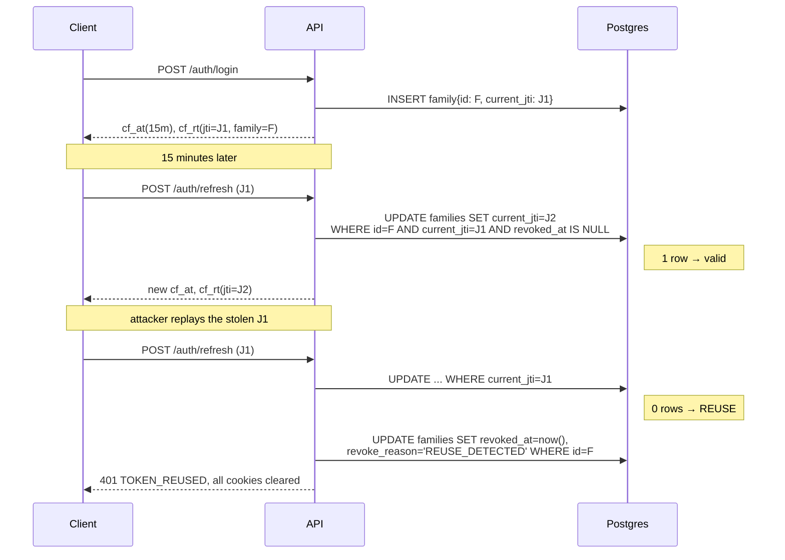

# 05 — Auth & Security

---

## 1. Password storage

**Argon2id**, not bcrypt. Bcrypt caps the input at 72 bytes and has no memory
hardness; Argon2id is the current recommendation and Go has it in
`golang.org/x/crypto/argon2`.

```go
// internal/platform/crypto/password.go
type Params struct {
    Memory      uint32 // 64 * 1024 KiB  = 64 MiB
    Iterations  uint32 // 3
    Parallelism uint8  // 2
    SaltLength  uint32 // 16
    KeyLength   uint32 // 32
}
```

Encode as PHC string so parameters travel with the hash and you can raise the
cost later without breaking existing users:

```
$argon2id$v=19$m=65536,t=3,p=2$<b64salt>$<b64hash>
```

On successful login, if the stored params are weaker than current params,
re-hash with the new ones and update. That's how you migrate cost factors
without a mass reset.

**Timing:** when the email doesn't exist, still run a verify against a fixed
dummy hash before returning. Otherwise login latency tells an attacker which
emails are registered.

---

## 2. Tokens

| Token | Lifetime | Storage | Contents |
| --- | --- | --- | --- |
| Access | **15 minutes** | `cf_at` cookie, httpOnly, Secure, SameSite=Lax | `sub`, `role`, `jti`, `iat`, `exp` |
| Refresh | **30 days** | `cf_rt` cookie, httpOnly, Secure, SameSite=Lax, `Path=/api/v1/auth` | `sub`, `family_id`, `jti`, `iat`, `exp` |
| CSRF | matches access | `cf_csrf` cookie, **not** httpOnly | random 32 bytes |

Signed with **HS256** and two *different* secrets (`JWT_ACCESS_SECRET`,
`JWT_REFRESH_SECRET`). Different secrets mean a leaked access secret can't mint
refresh tokens.

### What the access token must not contain

No email, no display name, no favourite anything. Every claim you add is a claim
that goes stale for 15 minutes and that you can't revoke. `sub` + `role` + `jti`
is enough; anything else is a database read the handler should do itself.

The 15-minute lifetime is what makes it acceptable that `role` is in the token
at all — an admin demoted at 12:00 loses admin at 12:15 worst case. If that's too
long, check `role` against Postgres on admin routes specifically. Recommended:
do exactly that. Admin routes are rare and correctness there is worth a read.

### Secret loading

Load once at startup into a package-level struct and **fail fast if absent**:

```go
func MustLoadSecrets() Secrets {
    a := os.Getenv("JWT_ACCESS_SECRET")
    r := os.Getenv("JWT_REFRESH_SECRET")
    if len(a) < 32 || len(r) < 32 { log.Fatal("JWT secrets missing or too short") }
    if a == r { log.Fatal("access and refresh secrets must differ") }
    return Secrets{Access: []byte(a), Refresh: []byte(r)}
}
```

Reading `os.Getenv` inside the signing function on every request — the pattern
ADR-001 in the MagicStream repo describes as "lazy" — means a missing secret
produces tokens signed with an empty key at runtime instead of a crash at boot.
Fail at boot. Always.

---

## 3. Refresh rotation with reuse detection

The mechanism, and why each part exists.



The compare-and-swap `WHERE current_jti = $old` is the entire mechanism. It is
atomic, it needs no locks, and it makes two concurrent refreshes resolve
deterministically — one wins, one is treated as reuse.

**The known false positive:** a client with two tabs, or a flaky network causing
a retry, can legitimately present the same refresh token twice and get its
session burned. Mitigation: a **10-second grace window** where the immediately
previous jti is also accepted, tracked as `previous_jti` on the family. Accept
the previous jti *without rotating again* and return the current access token.
Beyond the grace window, treat as reuse. This is what real implementations do,
and skipping it produces support tickets you'll misdiagnose for weeks.

### Logout

- Revoke the family (`revoke_reason = 'LOGOUT'`).
- Add the access token's `jti` to Redis: `SET jwt:deny:{jti} 1 EX <seconds until exp>`.
- Clear all three cookies with `Max-Age=0` **and the identical path/domain
  attributes used when setting them**, or the browser keeps them.

The auth middleware checks the denylist on every request — one Redis `EXISTS`,
sub-millisecond. If Redis is down, skip the check and log a warning: a
15-minute window where a logged-out token still works is a smaller problem than
a total auth outage. Document that trade-off; don't let it be accidental.

---

## 4. Authorisation

Three distinct layers. Conflating them is the root cause of most access-control
bugs, including IDOR.

| Layer | Question | Where | Failure |
| --- | --- | --- | --- |
| **Authentication** | who are you? | `AuthMiddleware` | 401 |
| **Role** | are you an admin? | `RequireRole("ADMIN")` middleware | 403 |
| **Ownership** | is *this* resource yours? | **inside the service**, never middleware | 403 or 404 |

### Ownership is not a middleware concern

```go
// WRONG — middleware can't know what "owner" means for this resource
router.PATCH("/campaigns/:id", RequireOwner(), handler)

// RIGHT — the service loads the resource and checks
func (s *Service) UpdateCampaign(ctx context.Context, actor Actor, id uuid.UUID, in UpdateInput) error {
    c, err := s.repo.GetCampaign(ctx, id)
    if err != nil { return err }
    if c.CreatorID != actor.UserID && actor.Role != RoleAdmin {
        return errs.NotFound("campaign not found")   // 404, not 403 — no enumeration oracle
    }
    if !c.Status.AllowsEdit(in.ChangedFields()) {
        return errs.Conflict("campaign is not editable in state %s", c.Status)
    }
    ...
}
```

Two rules that fall out of this:

1. **Never trust an ID from the request to identify the actor.** The user id
   comes from the token, via context, only. Any handler that reads `user_id`
   from a body or query param is an IDOR waiting to happen.
2. **Load, then check, then act.** Never `UPDATE ... WHERE id = $1 AND creator_id = $2`
   as the *only* check — it returns "0 rows affected" which you then have to
   interpret, and it can't distinguish "not yours" from "doesn't exist" from
   "no change needed".

### The shared authorisation helper

One function, used everywhere. This is the consolidation-of-six-implementations
lesson applied preemptively:

```go
// internal/platform/authz
func CanActOn(actor Actor, ownerID uuid.UUID) error {
    switch {
    case actor.Role == RoleAdmin:            return nil
    case actor.UserID == ownerID:            return nil
    default:                                 return errs.NotFound("not found")
    }
}
```

---

## 5. Webhook signature verification

```go
func VerifyRazorpaySignature(rawBody []byte, header, secret string) error {
    mac := hmac.New(sha256.New, []byte(secret))
    mac.Write(rawBody)
    want := hex.EncodeToString(mac.Sum(nil))
    if !hmac.Equal([]byte(want), []byte(header)) {
        return errs.Unauthenticated("invalid webhook signature")
    }
    return nil
}
```

Three ways to get this wrong, all of which you will hit:

1. **Comparing with `==`.** Use `hmac.Equal` — it's constant-time. String
   comparison leaks the signature byte by byte to a patient attacker.
2. **Verifying against a re-serialised body.** Gin's binding consumes and
   re-marshals; key order and whitespace change; the HMAC no longer matches.
   Read raw bytes first, verify, *then* unmarshal. See the middleware sketch in
   [06 §3](06-PAYMENTS-RAZORPAY.md#3-the-webhook-handler).
3. **Not verifying at all in dev** "because it's annoying". Then shipping it.
   Make the secret required and use Razorpay's test-mode secret locally.

Also record `signature_valid` on the `payment_events` row even for failures —
a burst of invalid signatures is either a misconfiguration or someone probing,
and both are worth an alert.

---

## 6. Presigned URL safety

Presigning is delegating your storage credentials for a narrow purpose. Narrow
it properly.

| Control | Value | Why |
| --- | --- | --- |
| TTL | 15 min upload, 5 min playback, 1 h download | short enough that a leaked URL expires before it spreads |
| Method | exactly one (`PUT` or `GET`) | never presign `*` |
| Key | **server-generated** `{asset_uuid}/{sanitised_name}` in `cinefund-originals` | client-controlled keys allow overwriting another asset |
| `Content-Type` | pinned in the signature | stops a client uploading an executable as `video/mp4` |
| `Content-Length` range | pinned via policy | stops a 1 MB presign becoming a 50 GB upload |
| Bucket | private, no public read, no public list | the signature is the only access path |

Verify after the fact too: `POST /complete` does a `HEAD` and checks the object
exists and its size is within tolerance of what was declared. A client that
declares 10 MB and uploads 10 MB of something that isn't a video is caught at
the `ffprobe` stage and the asset goes `REJECTED`.

**Never presign a `GET` for the original.** Playback is served from renditions
only. The original is the master copy and there is no reason for a browser to
ever have a URL to it.

This one is enforced structurally rather than by discipline: originals live in
`cinefund-originals`, and **the API's credentials have no `GetObject` permission
on that bucket at all** — only `PutObject`, to issue upload presigns. The
transcoder is the sole reader. A handler that tries to sign a GET for an original
fails with `AccessDenied` in development, not in production.

Same reasoning as enforcing tier limits with a `CHECK` constraint instead of an
`if`: make the wrong thing impossible rather than merely discouraged. Test S0 in
[10 §8](10-OBJECT-STORAGE.md#8-tests) asserts it.

---

## 7. Input validation

- `go-playground/validator` on every bound struct. Binding without validation is
  the same as not validating.
- **Allow-lists, never deny-lists**, for: sort fields, filter fields, content
  types, file extensions, redirect targets.
- Sort field allow-list is worth its own map, because `?sort=` reaching a query
  builder is a SQL-injection vector even with parameterised queries — you can't
  parameterise an identifier:

```go
var sortColumns = map[string]string{
    "newest":      "published_at DESC",
    "ending_soon": "deadline ASC",
    "most_funded": "raised_amount DESC",
    "trending":    "trending_score DESC",
}
col, ok := sortColumns[q.Sort]
if !ok { return errs.Invalid("unknown sort") }
```

- Body size limit: `http.MaxBytesReader` at 1 MiB globally, 64 KiB on auth
  routes. Without it, a 2 GB JSON body is a memory DoS.
- All SQL through `pgx` parameters. No dynamic SQL built from user input.

```go
// dangerous: user controls the key
filter := bson.M{userField: userValue}
// safe: key is from an allow-list
filter := bson.M{"category": category}
```

---

## 8. Transport and headers

```go
secure := func(c *gin.Context) {
    c.Header("X-Content-Type-Options", "nosniff")
    c.Header("X-Frame-Options", "DENY")
    c.Header("Referrer-Policy", "strict-origin-when-cross-origin")
    c.Header("Permissions-Policy", "geolocation=(), microphone=(), camera=()")
    c.Header("Strict-Transport-Security", "max-age=31536000; includeSubDomains")
    c.Next()
}
```

CORS: explicit origin list from `ALLOWED_ORIGINS`, `AllowCredentials: true`.
**Never `AllowOrigins: ["*"]` with credentials** — browsers reject the
combination, and the workaround people reach for (reflecting the `Origin`
header) turns every site on the internet into a trusted origin.

---

## 9. Secrets

| Secret | Where | Rotation |
| --- | --- | --- |
| `JWT_ACCESS_SECRET`, `JWT_REFRESH_SECRET` | env | rotate by supporting two keys with a `kid` header for one release |
| `RAZORPAY_KEY_SECRET`, `RAZORPAY_WEBHOOK_SECRET` | env | via the Razorpay dashboard; support two webhook secrets during the overlap |
| `POSTGRES_DSN`, `REDIS_ADDR` | env | — |
| `S3_ACCESS_KEY`, `S3_SECRET_KEY` | env | scoped to one bucket, PutObject/GetObject/HeadObject only |

`.env` is gitignored. `.env.example` has every key with empty values, and CI
asserts the two files have the same key set — a missing env var discovered in
production is entirely avoidable.

---

## 10. Threat model

The attacks worth designing against, and what stops each.

| Threat | Mitigation |
| --- | --- |
| Credential stuffing | per-IP and **per-email** rate limits on login; Argon2id cost; generic error message |
| Account enumeration | identical response and timing for unknown email on login and register |
| Stolen refresh token | rotation + reuse detection burns the family |
| XSS stealing tokens | httpOnly cookies; strict CSP; React escapes by default; never `dangerouslySetInnerHTML` on user content |
| CSRF | double-submit token + SameSite=Lax + no state change on GET |
| **IDOR** | ownership checked in the service against the token's `sub`; 404 not 403; one shared `CanActOn` helper |
| Webhook forgery | HMAC-SHA256 over the raw body, constant-time compare |
| Webhook replay | Redis SETNX + `payment_events` unique constraint |
| Double-refund | `uq_refund_active_per_pledge` partial unique index |
| Tier oversell | `FOR UPDATE` + `chk_tier_not_oversold` |
| Presigned URL abuse | short TTL, pinned method/type/size, server-generated key |
| Path traversal in media | keys are UUID-derived, never client strings; playlist rewriter validates every segment path against the asset prefix |
| SSRF via `portfolio_url` | never server-side fetched; rendered as a link with `rel="noopener noreferrer nofollow"` |
| Enumerating campaigns | non-public statuses return 404 to non-owners |
| Log leakage | structured logging with an explicit field allow-list; payment payloads logged by id and amount only |
| Admin abuse | every admin action in `audit_log`, in the same transaction as the change |
| Money DoS via order spam | `POST /pledges` rate limit; orphaned `CREATED` pledges swept every 15 min |

---

## 11. Pre-launch security checklist

Run before anything is publicly reachable.

```
[ ] JWT secrets ≥ 32 bytes, distinct, loaded at boot, process exits if missing
[ ] Registration ignores client-supplied `role` (test asserts it)
[ ] Every ownership check goes through authz.CanActOn (grep for CreatorID ==)
[ ] Webhook verifies raw body; a tampered body test returns 401
[ ] Replaying one webhook 50× changes raised_amount exactly once (test asserts it)
[ ] All presigns pin method, content-type, size, and use server-generated keys
[ ] Buckets are private; anonymous GET on a rendition key returns 403
[ ] CORS origin list has no wildcard; credentials allowed
[ ] Security headers present on every response (middleware test)
[ ] Body size limits set globally and tighter on auth
[ ] Sort/filter fields come from allow-list maps
[ ] `go vet`, `govulncheck`, `gosec` clean in CI
[ ] .env not committed; .env.example key-parity test passes
[ ] Rate limits verified by an integration test that actually gets a 429
[ ] Admin routes re-check role against Postgres, not just the token
[ ] audit_log written for every admin action (test per admin endpoint)
```
