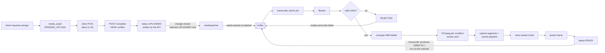

# 09 — Media Pipeline

Upload → probe → transcode → HLS. The largest phase in the build and the one
most likely to run over. Everything here is written to be typed in rather than
discovered.

> **Status note (2026-08-06).** The change-stream trigger shown in the diagram
> below is obsolete — MongoDB was dropped and the outbox now drives media jobs
> like every other event ([ADR-0010](DECISIONS/ADR-0010-postgres-only.md),
> [08 §6](08-EVENTING-OUTBOX-KAFKA.md)). The FFmpeg ladder, args, lease and
> temp-dir mechanics are unaffected.

---

## 1. The pipeline



**The API process never touches video bytes.** Not on upload, not on playback.
That is the design constraint everything else follows from.

**The transcoder publishes its own terminal events directly to Kafka** — it does
not rely on the watcher observing its Mongo writes. The watcher's `$match` is
`status == "UPLOADED"` and nothing else, so it never sees a status the transcoder
wrote. Without that split you get a double publish today and an infinite loop the
moment any consumer writes back to `media_assets`. Full reasoning in
[08 §6.1](08-EVENTING-OUTBOX-KAFKA.md#61-the-feedback-loop-rule).

**Nothing in the system is triggered by an object write.** Renditions land in S3
and no event fires, because storage is not an event source here — the database is.
That is why the classic "bucket event triggers a function that writes to the same
bucket" loop cannot occur.

---

## 2. Probing

Before deciding anything, find out what the file actually is.

```bash
ffprobe -v error \
        -print_format json \
        -show_format \
        -show_streams \
        -show_entries stream=index,codec_type,codec_name,width,height,r_frame_rate,\
bit_rate,pix_fmt,channels,sample_rate,duration:format=duration,size,bit_rate,format_name \
        "$INPUT"
```

`$INPUT` is a **presigned GET URL**, not a local path. FFmpeg reads HTTP natively
and, for probing, fetches only the bytes it needs — typically the first few
hundred KB for the moov atom. Downloading a 4 GB file to probe it is a mistake
you only make once.

> One caveat: if the source is an MP4 with the `moov` atom at the *end* (not
> "faststart"), FFmpeg has to range-request the tail. It handles this, but it
> costs an extra round trip. This is normal; don't chase it.

### Rejection rules

Applied immediately after probe. Reject early — transcoding a corrupt file wastes
40 minutes of CPU to produce nothing.

| Condition | Result |
| --- | --- |
| no video stream | `REJECTED: no_video_stream` |
| `duration` missing or 0 | `REJECTED: undeterminable_duration` |
| `duration > 3600` (1 h) for `purpose=FILM` | `REJECTED: too_long` |
| `duration > 300` for `purpose=PITCH` | `REJECTED: pitch_too_long` |
| `width < 640 or height < 360` | `REJECTED: resolution_too_low` |
| `codec_name` not in decodable set | `REJECTED: unsupported_codec` |
| container mismatch vs declared `content_type` | `REJECTED: content_type_mismatch` |

The container/content-type mismatch check is a real security control, not
pedantry: a client that presigned for `video/mp4` and uploaded something else is
either broken or probing you.

### Rotation

Phone footage carries a rotation matrix in metadata. `probe.video.rotation` is
90/180/270 and the effective display dimensions are swapped. If you compute the
ladder from the *stored* dimensions on a 90°-rotated 1920×1080 clip, you build a
ladder for landscape and output sideways portrait video.

```go
w, h := probe.Video.Width, probe.Video.Height
if probe.Video.Rotation == 90 || probe.Video.Rotation == 270 { w, h = h, w }
```

Modern FFmpeg auto-rotates on decode by default, so the *output* is usually
correct — but the *ladder decision* uses the raw numbers unless you swap them.
Do the swap.

---

## 3. The ABR ladder

```go
type Rung struct {
    Name         string
    Height       int
    VideoBitrate int   // bits/sec
    MaxRate      int   // = VideoBitrate * 1.07
    BufSize      int   // = VideoBitrate * 1.5
    AudioBitrate int
    Preset       string
    CRF          int
}

var fullLadder = []Rung{
    {"1080p", 1080, 5_000_000, 5_350_000, 7_500_000, 128_000, "medium", 21},
    {"720p",   720, 2_800_000, 2_996_000, 4_200_000, 128_000, "medium", 22},
    {"480p",   480, 1_400_000, 1_498_000, 2_100_000,  96_000, "fast",   23},
    {"360p",   360,   800_000,   856_000, 1_200_000,  64_000, "fast",   24},
    {"240p",   240,   400_000,   428_000,   600_000,  48_000, "veryfast", 26},
}

// Never upscale. A 480p source gets 480p, 360p, 240p — and nothing above.
func LadderFor(sourceHeight int) []Rung {
    out := make([]Rung, 0, len(fullLadder))
    for _, r := range fullLadder {
        if r.Height <= sourceHeight { out = append(out, r) }
    }
    if len(out) == 0 { out = append(out, fullLadder[len(fullLadder)-1]) }
    return out
}
```

**Never upscale.** Encoding a 480p source at 1080p produces a bigger file that
looks identical-to-worse and burns 4× the CPU. This is the single most common
mistake in homegrown transcoders.

Bitrates are the widely-used Apple/industry starting points. Tune later with
real content; do not tune before you have any.

---

## 4. The FFmpeg command

One invocation per rung. Understand every flag before you run it — this is the
command you'll be asked about.

```bash
ffmpeg -hide_banner -loglevel error -nostdin \
  -progress pipe:1 -stats_period 2 \
  -i "$INPUT_PRESIGNED_URL" \
  \
  -c:v libx264 -profile:v main -level 4.0 -preset "$PRESET" -crf "$CRF" \
  -maxrate "$MAXRATE" -bufsize "$BUFSIZE" \
  -vf "scale=-2:$HEIGHT:force_original_aspect_ratio=decrease,format=yuv420p" \
  -g 48 -keyint_min 48 -sc_threshold 0 -r 24 \
  \
  -c:a aac -b:a "$ABITRATE" -ac 2 -ar 48000 \
  \
  -f hls \
  -hls_time 6 \
  -hls_playlist_type vod \
  -hls_segment_type mpegts \
  -hls_flags independent_segments \
  -hls_segment_filename "$OUTDIR/seg_%05d.ts" \
  "$OUTDIR/index.m3u8"
```

### Flag by flag

| Flag | Why it's there |
| --- | --- |
| `-nostdin` | FFmpeg reads stdin for interactive keys. In a subprocess that steals input and can hang the worker. **Always set this.** |
| `-progress pipe:1 -stats_period 2` | Machine-readable progress on stdout every 2 s. This is how you drive the progress bar. |
| `-c:v libx264` | H.264 plays everywhere. AV1/HEVC are smaller but limit device support and encode far slower. |
| `-profile:v main -level 4.0` | Compatibility floor for older devices and smart TVs. |
| `-crf` + `-maxrate`/`-bufsize` | Constrained quality: CRF gives consistent visual quality, maxrate/bufsize cap the peak so the ABR ladder's advertised bandwidth is honest. CRF alone can spike far above the rung's bitrate on a busy scene and stall a client that selected it. |
| `scale=-2:H` | `-2` computes width preserving aspect ratio, rounded to an **even** number. H.264 with `yuv420p` requires even dimensions; `-1` can produce odd widths and fail. |
| `force_original_aspect_ratio=decrease` | Never distort non-16:9 source. |
| `format=yuv420p` | Some sources are 4:2:2 or 10-bit (ProRes). Browsers need 8-bit 4:2:0. Omitting this produces files that play in VLC and not in Chrome — a genuinely confusing bug. |
| `-g 48 -keyint_min 48 -sc_threshold 0` | **The most important line for ABR.** Fixed 2-second GOP at 24 fps. All rungs get keyframes at identical timestamps, so a player switching quality mid-stream lands on a keyframe boundary. Without `-sc_threshold 0`, FFmpeg inserts extra keyframes at scene changes and the rungs desynchronise — producing visible glitches on quality switches. |
| `-r 24` | Pin the frame rate so `-g 48` means exactly 2 seconds on every rung. Variable-frame-rate source otherwise makes GOP duration vary. For 30 fps content use `-g 60 -r 30`. |
| `-c:a aac -ac 2 -ar 48000` | Universal. Downmix to stereo — 5.1 in HLS is a rabbit hole. |
| `-hls_time 6` | 6-second segments. Shorter = faster start and finer switching, more requests and more playlist overhead. 6 is the common VOD choice. Must be a multiple of the GOP duration (6 = 3 × 2 s) or segments won't start on keyframes. |
| `-hls_playlist_type vod` | Marks the playlist complete so players enable seeking across the whole timeline. |
| `-hls_flags independent_segments` | Declares every segment independently decodable. Lets players start at any segment. |
| `-hls_segment_type mpegts` | Widest compatibility. fMP4 (`-hls_segment_type fmp4`) is more modern and shares segments with DASH — use it only if you're sure of your target players. |

### The GOP alignment rule, restated

If you take one thing from this document: **`-g`, `-keyint_min`, `-sc_threshold 0`
and `-r` must be identical across every rung, and `-hls_time` must be an integer
multiple of `g / r`.** Every ABR-switching artefact traces back to a violation of
this.

---

## 5. Parsing progress

`-progress pipe:1` emits key=value blocks terminated by `progress=continue`:

```
frame=1247
fps=52.30
out_time_us=51958333
speed=2.18x
progress=continue
```

```go
func (w *Worker) trackProgress(stdout io.Reader, totalUS int64, onUpdate func(float64, float64)) {
    sc := bufio.NewScanner(stdout)
    var outTimeUS int64
    var speed float64
    for sc.Scan() {
        k, v, ok := strings.Cut(sc.Text(), "=")
        if !ok { continue }
        switch k {
        case "out_time_us":
            outTimeUS, _ = strconv.ParseInt(v, 10, 64)
        case "speed":
            speed, _ = strconv.ParseFloat(strings.TrimSuffix(v, "x"), 64)
        case "progress":
            frac := math.Min(float64(outTimeUS)/float64(totalUS), 1.0)
            onUpdate(frac, speed)
        }
    }
}
```

`out_time_us` occasionally reports `N/A` early in a run — guard the parse rather
than letting a zero reset your progress bar to 0%.

Overall job progress is a **duration-weighted** average across rungs, not a plain
mean. The 1080p rung takes far longer than 360p, so a naive average jumps
strangely:

```go
// weight each rung by its bitrate as a proxy for encode cost
func overallProgress(tasks []Task) float64 {
    var num, den float64
    for _, t := range tasks {
        wgt := float64(t.Rung.VideoBitrate)
        num += t.Progress * wgt
        den += wgt
    }
    return num / den
}
```

---

## 6. The worker

```go
type Worker struct {
    sem        chan struct{}          // concurrency limiter
    ffmpegPath string
    store      objectstore.Store
    jobs       *mongo.Collection
    grpc       ControlPlaneClient
}
```

### Concurrency

FFmpeg is CPU-bound and already multi-threaded. Running 8 concurrent encodes on
8 cores means each gets ~1 core and all 8 finish slowly, with 8× the peak memory.

```
TRANSCODE_CONCURRENCY = max(1, NumCPU / 4)
FFMPEG_THREADS        = 4              # passed as -threads
```

Four cores per encode, `NumCPU/4` concurrent encodes. On an 8-core box: 2
concurrent jobs, 4 threads each. Tune with measurement, but start here — the
naive `NumCPU` default makes everything slower.

### Job lease and reclaim

```go
// Claim: atomic, so two workers can't take the same job.
job := jobs.FindOneAndUpdate(ctx,
    bson.M{"_id": jobID, "status": "QUEUED"},
    bson.M{"$set": bson.M{"status": "RUNNING", "worker_id": w.id,
                          "lease_expires_at": time.Now().Add(60 * time.Second)}},
)

// Heartbeat every 20s while running:
jobs.UpdateOne(ctx,
    bson.M{"_id": jobID, "worker_id": w.id},
    bson.M{"$set": bson.M{"lease_expires_at": time.Now().Add(60 * time.Second),
                          "progress": p, "tasks": tasks}})
```

The heartbeat filter includes `worker_id: w.id`. If another worker reclaimed the
job (because this one stalled), the heartbeat matches zero documents — that's the
signal to **abort immediately**, kill the FFmpeg process, and stop writing. Two
workers writing the same rendition keys concurrently is the one genuinely
corrupting failure mode in this pipeline.

Reclaim, run on a timer by every worker:

```go
jobs.FindOneAndUpdate(ctx,
    bson.M{"status": "RUNNING", "lease_expires_at": bson.M{"$lt": time.Now()}},
    bson.M{"$set": bson.M{"worker_id": w.id, "lease_expires_at": in60s},
           "$inc": bson.M{"attempt": 1}},
    options.FindOneAndUpdate().SetSort(bson.M{"lease_expires_at": 1}))
```

### Cancellation

```go
cmd := exec.CommandContext(ctx, w.ffmpegPath, args...)
cmd.Cancel = func() error { return cmd.Process.Signal(syscall.SIGTERM) }
cmd.WaitDelay = 10 * time.Second     // SIGKILL if it ignores SIGTERM
```

`exec.CommandContext` alone sends SIGKILL, which leaves partial segment files in
the temp directory. SIGTERM lets FFmpeg finish the current segment and close its
files. `WaitDelay` is the escalation, and without it a wedged FFmpeg blocks
shutdown forever.

### Working directory and cleanup

```go
dir, err := os.MkdirTemp(cfg.WorkDir, "cf-"+jobID+"-")
defer os.RemoveAll(dir)     // ALWAYS, including on panic
```

Check free space before starting: a 1-hour source across 4 rungs can produce
several GB. `TRANSCODE_MIN_FREE_BYTES` guard, fail the job with a clear
`disk_full` reason rather than dying mid-encode with a cryptic FFmpeg error.

### Idempotent output keys

Every rendition writes to a **deterministic** key:

```
renditions/{asset_id}/v{pipeline_version}/{rung}/index.m3u8
renditions/{asset_id}/v{pipeline_version}/{rung}/seg_00001.ts
```

A re-run overwrites byte-identical content at the same keys. No duplicates, no
orphans, no `_retry2` suffixes. `pipeline_version` in the path means bumping it
produces a fresh tree and the old one can be deleted by lifecycle rule after the
new one is live — a safe, atomic-feeling swap.

---

## 7. The master playlist

Written **only after every rung has fully uploaded**. It is the commit point of
the whole job.

```m3u8
#EXTM3U
#EXT-X-VERSION:3
#EXT-X-STREAM-INF:BANDWIDTH=5350000,AVERAGE-BANDWIDTH=5000000,RESOLUTION=1920x1080,CODECS="avc1.640028,mp4a.40.2"
1080p/index.m3u8
#EXT-X-STREAM-INF:BANDWIDTH=2996000,AVERAGE-BANDWIDTH=2800000,RESOLUTION=1280x720,CODECS="avc1.4d401f,mp4a.40.2"
720p/index.m3u8
#EXT-X-STREAM-INF:BANDWIDTH=1498000,AVERAGE-BANDWIDTH=1400000,RESOLUTION=854x480,CODECS="avc1.4d401e,mp4a.40.2"
480p/index.m3u8
#EXT-X-STREAM-INF:BANDWIDTH=856000,AVERAGE-BANDWIDTH=800000,RESOLUTION=640x360,CODECS="avc1.42c01e,mp4a.40.2"
360p/index.m3u8
```

- `BANDWIDTH` is the **peak** (use `maxrate` + audio), `AVERAGE-BANDWIDTH` the
  target. Understating peak makes players pick a rung they can't sustain.
- `CODECS` must be accurate or Safari and iOS refuse to play the variant, often
  silently. The profile/level hex maps directly to your `-profile:v`/`-level`:
  `main@4.0` → `avc1.4d4028`, `high@4.0` → `avc1.640028`,
  `baseline@3.0` → `avc1.42c01e`. Getting this wrong is a "works in Chrome,
  black screen on iPhone" bug.
- Order **highest bandwidth first**. Many players pick the first variant for the
  initial segment; some pick the last. Highest-first favours quality on good
  connections, and the ABR algorithm corrects within a segment or two either way.

Writing the master last is what makes the job atomic from the player's
perspective: until it exists, there's nothing to play; once it exists,
everything it references is already uploaded.

---

## 8. Thumbnails and sprites

**Poster** — a frame at 10% of duration (not frame 0, which is usually black):

```bash
ffmpeg -ss "$(echo "$DURATION * 0.1" | bc)" -i "$INPUT" -frames:v 1 \
       -vf "scale=1280:-2" -q:v 3 poster_1280.webp
```

`-ss` **before** `-i` seeks by keyframe without decoding everything — near
instant. After `-i` it decodes from the start, which on a 40-minute file takes
minutes. This flag order is one of the highest-leverage things to know about
FFmpeg.

**Sprite sheet** for scrub previews — one frame every 10 s, tiled 10×10:

```bash
ffmpeg -i "$INPUT" -vf "fps=1/10,scale=160:-2,tile=10x10" -q:v 5 sprite.jpg
```

Generate the matching WebVTT mapping timestamps to sprite regions:

```
WEBVTT

00:00:00.000 --> 00:00:10.000
sprite.jpg#xywh=0,0,160,90

00:00:10.000 --> 00:00:20.000
sprite.jpg#xywh=160,0,160,90
```

Cheap, and it's the detail that makes the player feel finished.

---

## 9. Playback: serving HLS from private storage

The problem nobody warns you about, and the one that will eat a day.

A master playlist references variant playlists by relative path; variant
playlists reference segments by relative path. If the bucket is private, the
player fetches `master.m3u8` with a valid signature, then requests
`720p/index.m3u8` **with no signature** and gets 403.

Three options:

| Option | How | Verdict |
| --- | --- | --- |
| **A. Public bucket** | make renditions publicly readable | trivially simple, zero access control. Fine for public trailers, unacceptable for backer-only films. |
| **B. Playlist rewriter** | API serves playlists as text, rewriting every referenced URL to a presigned URL | works with plain MinIO/S3, no CDN needed. **Use this in v1.** |
| **C. CDN signed cookies/tokens** | CloudFront signed cookies or a CDN token that covers a path prefix | the production answer; needs a CDN. |

### Option B in detail

```
GET /api/v1/films/{id}/hls/master.m3u8      → authorise, fetch from S3, rewrite, serve
GET /api/v1/films/{id}/hls/{rung}/index.m3u8 → authorise, fetch, rewrite segment URLs
GET  <segment>                               → presigned S3 URL, hits storage directly
```

The API serves **only playlists** — a few KB of text. Segments go straight from
storage to the player. The video bytes still never pass through Go.

```go
func rewriteVariant(playlist []byte, assetID, rung string, store objectstore.Store) ([]byte, error) {
    var out bytes.Buffer
    sc := bufio.NewScanner(bytes.NewReader(playlist))
    for sc.Scan() {
        line := sc.Text()
        if strings.HasPrefix(line, "#") || line == "" {
            out.WriteString(line + "\n")
            continue
        }
        // A media line. Validate before signing — never sign an arbitrary string
        // that came out of a file.
        if strings.Contains(line, "/") || strings.Contains(line, "..") {
            return nil, fmt.Errorf("unexpected path in playlist: %q", line)
        }
        key := path.Join("renditions", assetID, "v"+ver, rung, line)
        url, err := store.PresignedGet(ctx, key, 10*time.Minute)
        if err != nil { return nil, err }
        out.WriteString(url + "\n")
    }
    return out.Bytes(), sc.Err()
}
```

The traversal check is a real control. The playlist is a file you generated, but
treating it as untrusted input costs two lines and closes the path where a
crafted filename becomes a signed URL to an arbitrary object.

**Segment URL TTL vs playlist TTL.** Segment URLs are signed for 10 minutes but a
film runs 14. The player re-fetches the variant playlist periodically for VOD?
Not reliably — for `VOD` playlists, many players fetch once. So sign segments for
**duration + 30 minutes**, capped at 6 hours, and set the playlist cache header
to a shorter window. Alternatively serve a `#EXT-X-PLAYLIST-TYPE:EVENT`-style
refresh. Simplest correct answer for v1: sign for `max(30min, duration*2)`.

---

## 10. Configuration

| Env | Default | Purpose |
| --- | --- | --- |
| `FFMPEG_PATH` | `ffmpeg` | binary location |
| `FFPROBE_PATH` | `ffprobe` | |
| `TRANSCODE_CONCURRENCY` | `max(1, NumCPU/4)` | simultaneous encodes |
| `FFMPEG_THREADS` | `4` | `-threads` per encode |
| `TRANSCODE_WORK_DIR` | `/var/tmp/cinefund` | scratch space |
| `TRANSCODE_MIN_FREE_BYTES` | `10 GiB` | refuse to start below this |
| `TRANSCODE_JOB_TIMEOUT` | `2h` | hard ceiling per job |
| `TRANSCODE_LEASE_TTL` | `60s` | reclaim window |
| `TRANSCODE_MAX_ATTEMPTS` | `3` | before DLQ |
| `PIPELINE_VERSION` | `1` | bump to force re-transcode |
| `HLS_SEGMENT_SECONDS` | `6` | |

---

## 11. Docker image

```dockerfile
FROM golang:1.26-bookworm AS build
WORKDIR /src
COPY go.mod go.sum ./
RUN go mod download
COPY . .
RUN CGO_ENABLED=0 go build -o /out/transcoder ./cmd/transcoder

FROM debian:bookworm-slim
RUN apt-get update && \
    apt-get install -y --no-install-recommends ffmpeg ca-certificates && \
    rm -rf /var/lib/apt/lists/*
COPY --from=build /out/transcoder /usr/local/bin/transcoder
ENTRYPOINT ["transcoder"]
```

Not `alpine`: its FFmpeg build has historically shipped with a reduced codec set,
and you will discover this when a ProRes upload fails in a way that works
locally. `debian-slim` with the distro FFmpeg is ~300 MB and predictable. If size
matters later, build a static FFmpeg with exactly the codecs you need — but do
that as an optimisation, not as a starting point.

Give the transcoder container a CPU limit. An unbounded FFmpeg will happily
consume every core on the host and starve Postgres.

---

## 12. Tests

| # | Scenario | Assertion |
| --- | --- | --- |
| M1 | 10 s 1080p sample | 4 rungs, all `index.m3u8` valid, master references all 4 |
| M2 | 480p source | ladder has exactly 3 rungs, none above 480p |
| M3 | Portrait 1080×1920 | output is portrait; ladder computed from display dimensions |
| M4 | 90°-rotated source | output upright |
| M5 | Audio-only file | `REJECTED: no_video_stream`, no FFmpeg invoked |
| M6 | Corrupt bytes with a video content-type | `REJECTED`, error captured, no retry |
| M7 | Kill worker mid-job | lease expires, second worker reclaims, job completes |
| M8 | Same Kafka message twice | one job (unique `{asset_id, pipeline_version}`), one set of renditions |
| M9 | Keyframe alignment | `ffprobe -show_frames` on every rung: keyframe timestamps identical |
| M10 | Segment durations | all within 10% of `hls_time` except the last |
| M11 | Disk fills mid-encode | job fails with `disk_full`, temp dir cleaned, no partial upload |
| M12 | Playlist rewriter | every segment URL signed and valid; a crafted `../` line is rejected |
| M13 | 10-bit 4:2:2 ProRes | output is `yuv420p` 8-bit and plays in Chrome |

**M9 is the test that proves the ABR ladder is correct**, and it's the one nobody
writes. Write it:

```bash
for r in 1080p 720p 480p 360p; do
  ffprobe -v error -select_streams v -show_frames \
          -show_entries frame=pkt_pts_time,key_frame \
          -of csv "$OUT/$r/index.m3u8" | grep ',1$' | cut -d, -f2
done | sort | uniq -c
# every timestamp must appear exactly 4 times
```

M13 is the one that catches the missing `format=yuv420p` — and it's the failure
that looks like "the video is broken" rather than "a pixel format is wrong".
