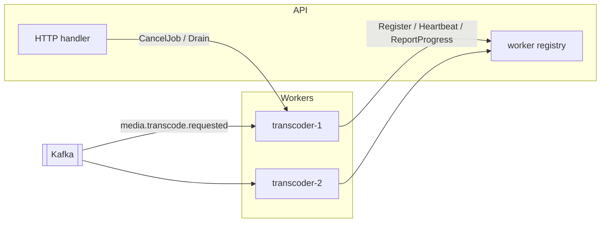

# 13 — gRPC Control Plane

Kafka dispatches work. gRPC controls it.

> **Status note (2026-08-06).** Progress is written to Postgres, not Mongo (the
> two-store split was reversed — [ADR-0010](DECISIONS/ADR-0010-postgres-only.md)).
> The control-plane contracts and failure tolerances are unchanged.

---

## 1. Why both

A reasonable objection: you already have Kafka, so why add a second transport?

Because they answer different questions, and forcing one to do the other's job is
where the design goes wrong.

| | Kafka | gRPC |
| --- | --- | --- |
| Direction | producer → many consumers, decoupled | caller → a *specific* server, coupled |
| Timing | asynchronous, at-least-once | synchronous request/response |
| Failure | retry, DLQ, replay | error returned now |
| Good for | "transcode this asset" | "what is job X doing *right now*?", "stop job X" |

Three things Kafka is genuinely bad at here:

1. **Cancellation.** "Stop job X" via Kafka means every transcoder consumes a
   cancel topic and checks whether it owns that job. Latency is unbounded and the
   semantics are awkward. gRPC calls the one worker holding the lease.
2. **Live progress.** Progress at 2-second intervals across 20 concurrent jobs is
   ~600 messages/minute with a 5-second useful lifespan. Putting that on a
   durable, replicated log is the wrong storage class entirely.
3. **Synchronous query.** "Is this worker healthy, what's its queue depth" wants
   an answer now, not eventually.

So: **Kafka for work dispatch and durable domain events; gRPC for live control
and observation.** That is the split, and it is a defensible one to state out
loud.

---

## 2. Topology



**Workers dial the API, not the reverse.** Workers are ephemeral, may be behind
NAT, and scale up and down; the API is stable and addressable. Workers register
on start and hold a long-lived bidirectional stream, and the API sends commands
down it.

Same shape as a Kubernetes kubelet or a CI runner — the right topology whenever
the controlled side is more numerous and less addressable than the controller.

---

## 3. Protobuf contract

`proto/cinefund/transcode/v1/transcode.proto`

```protobuf
syntax = "proto3";
package cinefund.transcode.v1;
option go_package = "github.com/maczeo11/cinefund/internal/gen/transcodev1;transcodev1";

import "google/protobuf/timestamp.proto";

service TranscodeControl {
  // Long-lived bidirectional stream. Worker sends status; server sends commands.
  rpc Connect(stream WorkerMessage) returns (stream ServerCommand);

  // Unary: progress, called every ~2s per running job.
  rpc ReportProgress(ProgressReport) returns (ReportAck);

  // Unary: worker asks whether it should still be doing this.
  rpc CheckJobStatus(CheckJobStatusRequest) returns (CheckJobStatusResponse);
}

message WorkerMessage {
  oneof message {
    RegisterRequest register  = 1;
    Heartbeat       heartbeat = 2;
    JobCompleted    completed = 3;
    JobFailed       failed    = 4;
  }
}

message RegisterRequest {
  string worker_id       = 1;   // "transcoder-7f3a@10.0.0.14"
  string version         = 2;   // build sha
  int32  max_concurrency = 3;
  string ffmpeg_version  = 4;
  repeated string capabilities = 5;   // ["h264", "hevc", "gpu"]
}

message Heartbeat {
  string worker_id       = 1;
  int32  active_jobs     = 2;
  double cpu_percent     = 3;
  uint64 free_disk_bytes = 4;
  google.protobuf.Timestamp sent_at = 5;
}

message JobCompleted {
  string job_id      = 1;
  string asset_id    = 2;
  repeated Rendition renditions = 3;
  int64  duration_ms = 4;
}

message JobFailed {
  string job_id      = 1;
  string asset_id    = 2;
  string stage       = 3;   // "probe" | "encode" | "upload"
  string message     = 4;
  string ffmpeg_tail = 5;   // last ~2KB of stderr — invaluable for debugging
  bool   retryable   = 6;
}

message Rendition {
  string name          = 1;   // "720p"
  string key           = 2;
  int32  width         = 3;
  int32  height        = 4;
  int64  bandwidth     = 5;
  string codec         = 6;   // "avc1.4d401f"
  int32  segment_count = 7;
  int64  size_bytes    = 8;
}

message ServerCommand {
  oneof command {
    CancelJob   cancel = 1;
    DrainWorker drain  = 2;   // finish current jobs, accept no more
    PingCommand ping   = 3;
  }
}

message CancelJob   { string job_id = 1; string reason = 2; }
message DrainWorker { string reason = 1; }
message PingCommand { string nonce  = 1; }

message ProgressReport {
  string job_id           = 1;
  string asset_id         = 2;
  double overall_progress = 3;   // 0.0–1.0
  repeated TaskProgress tasks = 4;
  int32  eta_seconds      = 5;
  double speed            = 6;   // FFmpeg "2.18x"
}

message TaskProgress {
  string name     = 1;
  string status   = 2;   // QUEUED | RUNNING | SUCCEEDED | FAILED
  double progress = 3;
}

message ReportAck {
  // The server's chance to say "stop" without a separate channel.
  bool should_cancel = 1;
}

message CheckJobStatusRequest  { string job_id = 1; string worker_id = 2; }
message CheckJobStatusResponse {
  bool   still_assigned = 1;   // false → this worker lost the lease
  string status         = 2;
}
```

### Two design points worth defending

**`ReportAck.should_cancel`.** Progress is reported every 2 seconds anyway.
Piggy-backing the cancellation signal on that response gives you cancellation
with at most 2 seconds of latency and **zero** additional machinery — no extra
stream, no polling loop. The bidirectional `Connect` stream is the low-latency
path; this is the one that still works when the stream has dropped and hasn't
reconnected yet.

**`CheckJobStatus.still_assigned`.** This closes the lease-expiry race from
[09 §6](09-MEDIA-PIPELINE.md#job-lease-and-reclaim): a stalled worker wakes up
and resumes writing renditions for a job another worker now owns. The worker
calls this before each expensive stage; `false` means abort immediately. A cheap
belt to go with the Mongo braces.

---

## 4. Generation

```bash
protoc --go_out=. --go_opt=paths=source_relative \
       --go-grpc_out=. --go-grpc_opt=paths=source_relative \
       proto/cinefund/transcode/v1/transcode.proto
```

Generated code goes to `internal/gen/transcodev1/` and **is committed**. A build
that requires `protoc` on every machine and in CI is a build that breaks for
someone. Commit the generated files and add a `make proto-check` target that
regenerates and fails if the tree is dirty.

Prefer **`buf`** if you're willing to add one tool: `buf lint` and `buf breaking`
against the main branch catch backwards-incompatible schema changes before they
merge, which is the entire reason to use protobuf over JSON here.

---

## 5. Server side

```go
func (s *ControlServer) Connect(stream transcodev1.TranscodeControl_ConnectServer) error {
    first, err := stream.Recv()
    if err != nil { return err }
    reg := first.GetRegister()
    if reg == nil {
        return status.Error(codes.InvalidArgument, "first message must be Register")
    }

    s.registry.Add(reg.WorkerId, stream, reg)
    defer s.registry.Remove(reg.WorkerId)
    s.log.Info("worker connected", "worker_id", reg.WorkerId, "ffmpeg", reg.FfmpegVersion)

    for {
        msg, err := stream.Recv()
        if err == io.EOF { return nil }
        if err != nil    { return err }

        switch m := msg.Message.(type) {
        case *transcodev1.WorkerMessage_Heartbeat:
            s.registry.Touch(reg.WorkerId, m.Heartbeat)
        case *transcodev1.WorkerMessage_Completed:
            if err := s.jobs.MarkCompleted(stream.Context(), m.Completed); err != nil {
                s.log.Error("mark completed failed", "job_id", m.Completed.JobId, "error", err)
            }
        case *transcodev1.WorkerMessage_Failed:
            if err := s.jobs.MarkFailed(stream.Context(), m.Failed); err != nil {
                s.log.Error("mark failed failed", "job_id", m.Failed.JobId, "error", err)
            }
        }
    }
}
```

The registry is an in-memory `map[string]*workerConn` guarded by a mutex, and it
is **deliberately not persisted** — it's live connection state, and a restarted
API has no live connections by definition. Workers reconnect within their retry
backoff.

The consequence to accept: with multiple API replicas, a worker is connected to
exactly one, so `CancelJob` must reach that replica. For v1 with a single API
replica this is a non-issue. When you scale out, the answer is a Redis pub/sub
fan-out of cancel commands to every replica, each forwarding to any worker it
holds. Note it now so the growth path is obvious rather than surprising.

---

## 6. Worker side

```go
func (w *Worker) maintainConnection(ctx context.Context) {
    backoff := 1 * time.Second
    for ctx.Err() == nil {
        if err := w.connectOnce(ctx); err != nil {
            w.log.Warn("control plane disconnected", "error", err, "retry_in", backoff)
            select {
            case <-time.After(backoff):
            case <-ctx.Done():
                return
            }
            backoff = min(backoff*2, 30*time.Second)
            continue
        }
        backoff = 1 * time.Second
    }
}
```

**A disconnected control plane must not stop transcoding.** The worker keeps
consuming Kafka and keeps writing progress to Mongo; it loses live control and
reporting, nothing more. Making the control plane a hard dependency would mean an
API restart halts all transcoding — precisely the coupling that separate binaries
were meant to avoid.

Progress is written to **both** Mongo (durable, survives disconnection) and gRPC
(live). Mongo is the source of truth for `GET /media/assets/{id}`; gRPC is the
low-latency path. Redundant on purpose.

---

## 7. Transport

| Setting | Value | Why |
| --- | --- | --- |
| Auth | shared bearer token in `authorization` metadata | internal network; a token is enough for v1 |
| TLS | none locally; mTLS if workers cross a network boundary | |
| Keepalive | client 30 s ping / 10 s timeout; server `MinTime: 20s`, `PermitWithoutStream: true` | |
| Max message size | 4 MB default is fine; `ffmpeg_tail` capped at 2 KB | |
| Port | `:9090` alongside HTTP `:8080` | separate listener, same process |

The keepalive row is the one that will bite you. `PermitWithoutStream: true` on
the **server** is required, or the server rejects the client's pings when no RPC
is active and closes the connection. Symptom: a worker that "stops responding"
after a few idle minutes with no error on either side.

---

## 8. Tests

| # | Scenario | Assertion |
| --- | --- | --- |
| G1 | Worker registers | appears in registry with correct capabilities |
| G2 | Worker disconnects | removed within the keepalive timeout |
| G3 | API restarts | worker reconnects with backoff, no lost jobs |
| G4 | `CancelJob` sent | FFmpeg gets SIGTERM within 2 s, temp dir cleaned |
| G5 | Stream dead, `ReportProgress` returns `should_cancel=true` | worker aborts |
| G6 | `CheckJobStatus` returns `still_assigned=false` | worker aborts before writing renditions |
| G7 | Control plane unreachable for 5 min | transcoding continues; progress still lands in Mongo |
| G8 | 20 workers connected | heartbeats tracked, no goroutine leak (`go.uber.org/goleak`) |
| G9 | `buf breaking` against main | fails on a removed field |

G7 proves the decoupling and G9 protects the contract. Both are cheap; write
them.
